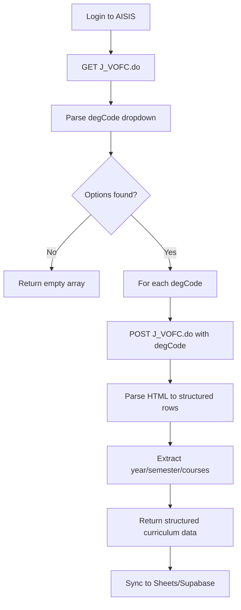

# Curriculum Scraping - Technical Details

## Current Status: EXPERIMENTAL SUPPORT VIA J_VOFC.do WITH STRUCTURED PARSING

The AISIS curriculum scraper now has **experimental support** using the `J_VOFC.do` endpoint discovered through HAR file analysis, **with structured parsing that produces row-based data like schedules**.

## Background

### Previous Limitation (J_VOPC.do)
The original implementation attempted to scrape official curriculum data using:
```
POST /j_aisis/J_VOPC.do
```

However, this endpoint **does not exist** in AISIS and returns **HTTP 404**.

### Current Implementation (J_VOFC.do + Structured Parser)
Through analysis of HAR file captures (`official curriculums.har`), a working curriculum endpoint was discovered:

```
Endpoint: https://aisis.ateneo.edu/j_aisis/J_VOFC.do
Method: GET (for form) / POST (for curriculum data)
Parameter: degCode (curriculum version identifier)
```

**How it works:**
1. GET `J_VOFC.do` returns a form with `<select name="degCode">` dropdown
2. Each option value represents a curriculum version (e.g., `BS CS_2024_1`)
3. POST `J_VOFC.do` with `degCode=<value>` returns curriculum HTML for each version
4. **NEW**: Parse HTML with cheerio to extract structured course rows
5. **NEW**: Sync structured data to Google Sheets/Supabase (like schedules)

## Implementation Details

### Workflow



### Methods Implemented

#### 1. `getDegreePrograms()`
- **Purpose**: Retrieve all available curriculum versions
- **Process**:
  1. GET request to `J_VOFC.do`
  2. Parse `<select name="degCode">` element
  3. Extract all `<option>` values and labels
- **Returns**: Array of `{ degCode, label }` objects
- **Example**:
  ```javascript
  [
    { degCode: 'AB AM_2018_1', label: 'AB Applied Mathematics (2018-1)' },
    { degCode: 'BS CS_2024_1', label: 'BS Computer Science (2024-1)' },
    ...
  ]
  ```

#### 2. `scrapeCurriculum()`
- **Purpose**: Orchestrate full curriculum scraping
- **Process**:
  1. Call `getDegreePrograms()` to get list
  2. Iterate through each `degCode`
  3. Call `_scrapeDegree()` for each
  4. Flatten HTML using `_flattenCurriculumHtmlToText()`
  5. Aggregate results
- **Returns**: Array of `{ degCode, label, raw_text }` objects

#### 3. `_scrapeDegree(degCode, retryCount)`
- **Purpose**: Fetch curriculum HTML for a specific version
- **Process**:
  1. Build form data with `degCode` parameter
  2. POST to `J_VOFC.do`
  3. Validate session (check for login failures)
  4. Return raw HTML
- **Error Handling**:
  - Retries on 5xx errors (up to MAX_RETRIES)
  - Throws on 4xx errors with clear message
  - Detects session expiry

#### 4. `_flattenCurriculumHtmlToText(html)` (Legacy)
- **Purpose**: Convert curriculum HTML to structured text (kept for backward compatibility)
- **Process**:
  1. Extract page/program header
  2. Traverse table rows
  3. Identify headers (year/semester) via `td.text04` class
  4. Identify course rows via `td.text02` or `td[background*="spacer_lightgrey"]`
  5. Join cells with tabs, lines with newlines
- **Returns**: Multi-line text with headers and tab-separated course data
- **Status**: Still included in scraped data as `raw_text` field for backward compatibility

## AISIS Session Bleed and Race Conditions

### The Problem

AISIS J_VOFC.do endpoint suffers from **server-side session bleed** when handling concurrent or rapid requests. This manifests as:

**Symptoms:**
- For some `degCode` values (e.g., `BS ME_2025_1`, `AB DS_2024_1`), AISIS sometimes returns HTML for a **different** program
- The POST request payload's `degCode` is correct, but the HTML response contains data for a previously-selected program
- This occurs more frequently with:
  - Higher concurrency (multiple programs scraped in parallel)
  - Lower delays between requests (< 1 second)
  - Sequential requests for different programs without sufficient delay

**Impact:**
- Contaminated data in Supabase/Google Sheets
- Rows where `deg_code` is for one program (e.g., BS ME) but `program_title` and course list belong to a different program (e.g., BS MGT-H)
- Data integrity issues that are hard to detect manually

**Root Cause:**
The AISIS server appears to maintain session state for the "currently selected" curriculum in the backend. When requests arrive too quickly or concurrently, the server may return HTML for the wrong program, even though the request specified the correct `degCode`.

### Validation and Defense Mechanisms

To prevent contaminated data from being persisted, the scraper now implements multiple layers of validation:

#### 1. Program Title Validation (`isProgramMatch`)

**Location:** `src/curriculum-parser.js`

**Purpose:** Validates that HTML program title matches the requested `degCode` and `label`

**How it works:**
```javascript
export function isProgramMatch(degCode, label, programTitle) {
  // Normalize strings (uppercase, collapse whitespace)
  // Extract base program code from degCode (e.g., "BS ME" from "BS ME_2025_1")
  // Remove version suffix from label (e.g., "(2025-1)")
  
  // Check 1: Direct substring match (either direction)
  // Check 2: Program title contains base program code
  // Check 3: Significant word overlap between label and title
  // Check 4: Code component abbreviations (MGT->MANAGEMENT, ME->MECHANICAL, etc.)
  
  // Match criteria (any one is sufficient):
  // - Direct label/title match OR
  // - Base code in title + 40%+ word overlap OR
  // - 70%+ word overlap (even without base code) OR
  // - 80%+ code components found + 40%+ word overlap
  
  return isMatch;
}
```

**Examples:**
- ✅ Match: `degCode="BS ME_2025_1"`, `programTitle="BS Mechanical Engineering"` 
- ✅ Match: `degCode="BS MGT-H_2025_1"`, `programTitle="BS Management - Honors Program"`
- ✅ Match: `degCode="BS CS_2024_1"`, `programTitle="Bachelor of Science in Computer Science"`
- ❌ Mismatch: `degCode="BS ME_2025_1"`, `programTitle="BS Management (Honors)"`
- ❌ Mismatch: `degCode="AB DS_2024_1"`, `programTitle="AB Applied Mathematics"`

#### 2. Circuit Breaker in Parser (`parseCurriculumHtml`)

**Location:** `src/curriculum-parser.js`

**Purpose:** Refuse to parse HTML that doesn't match the requested program

**Behavior:**
```javascript
const programTitle = extractProgramTitle($) || label;

if (!isProgramMatch(degCode, label, programTitle)) {
  console.error(`🚨 CRITICAL: Curriculum HTML mismatch detected!`);
  console.error(`   Requested degCode: ${degCode}`);
  console.error(`   HTML program_title: ${programTitle}`);
  throw new Error(`Curriculum HTML mismatch for ${degCode}`);
}
```

**Result:** Parser throws error **before** extracting any course rows, preventing contamination

#### 3. Validation and Retry Wrapper (`_scrapeDegreeWithValidation`)

**Location:** `src/scraper.js`

**Purpose:** Validate HTML at scraping time and retry on mismatch

**Behavior:**
- Fetches HTML via `_scrapeDegree(degCode)`
- Validates program title matches `degCode` and `label` using `isProgramMatch`
- If validation fails:
  - Logs warning with attempt count
  - Retries with exponential backoff (2s, 4s, 8s...)
  - Maximum 3 attempts by default
- After max attempts, throws error and refuses to accept HTML

**Result:** Most session bleeds are resolved by retrying after a delay

#### 4. Safe Parsing in `parseAllCurricula`

**Location:** `src/curriculum-parser.js`

**Purpose:** Skip programs with mismatch errors, don't contaminate output

**Behavior:**
```javascript
try {
  const rows = parseCurriculumHtml(html, degCode, label);
  // ... add to programs and allRows
} catch (error) {
  if (error.message.includes('Curriculum HTML mismatch')) {
    console.warn(`⚠️ Skipping ${degCode} due to HTML mismatch`);
    // Do NOT push any rows - prevent contamination
  } else {
    throw error; // Re-throw unexpected errors
  }
}
```

**Result:** Programs with mismatched HTML are excluded from final output

### Safe Configuration Settings

To minimize AISIS session bleed, use these recommended settings:

#### Production / CI (Maximum Safety)
```bash
# Sequential scraping (no concurrency)
CURRICULUM_CONCURRENCY=1

# 2-second delay between requests
CURRICULUM_DELAY_MS=2000

# Don't use FAST_MODE
```

#### Development / Testing (Balanced)
```bash
# Low concurrency
CURRICULUM_CONCURRENCY=2

# 1-second delay
CURRICULUM_DELAY_MS=1000
```

#### Fast Mode (Higher Risk)
```bash
# Enable fast mode
FAST_MODE=true

# This sets:
# - CURRICULUM_DELAY_MS=500 (reduced from 2000)
# - Still uses CURRICULUM_CONCURRENCY=1 by default
```

**WARNING:** Higher concurrency (> 2) and lower delays (< 1000ms) significantly increase the risk of session bleed.

### Debug Instrumentation

Set `DEBUG_DEGCODE` to inspect raw HTML and parsed rows for a specific program:

```bash
DEBUG_DEGCODE="BS ME_2025_1" npm run curriculum
```

This creates in `debug/`:
- `{degCode}-raw.html` - Raw HTML from AISIS
- `{degCode}-raw.json` - Full scraped object
- `{degCode}-rows.json` - Parsed course rows
- `{degCode}-mismatch.html` - HTML that failed validation (if mismatch occurred)

Use this to verify:
- `program_title` matches `deg_code`
- Course list matches expected curriculum
- No contamination from other programs

### Monitoring and Detection

**Signs of session bleed in logs:**
```
⚠️ Validation failed for BS ME_2025_1 (attempt 1/3): 
   HTML contains "BS Management (Honors)" but expected "BS Mechanical Engineering"
   Retrying after 2000ms (AISIS session bleed suspected)...
```

**Signs of successful retry:**
```
✅ BS ME_2025_1: Validation passed on attempt 2
```

**Signs of persistent failure:**
```
🚨 CRITICAL: Curriculum HTML mismatch detected!
   Requested degCode: BS ME_2025_1
   HTML program_title: BS Management (Honors)
⚠️ Skipping BS ME_2025_1 due to HTML mismatch (session bleed detected)
```

**Metrics to track:**
- Validation failures per scrape
- Programs skipped due to mismatch
- Retry success rate
- Total programs scraped vs. total programs available

If validation failures exceed 10% of programs, consider:
1. Increasing `CURRICULUM_DELAY_MS`
2. Reducing `CURRICULUM_CONCURRENCY` to 1
3. Running scraper during low-traffic hours
4. Contacting AISIS administrators about session handling


#### 5. `parseCurriculumHtml(html, degCode, label)` (**NEW**)
- **Module**: `src/curriculum-parser.js`
- **Purpose**: Parse curriculum HTML into structured course row objects
- **Process**:
  1. Load HTML with cheerio
  2. Extract program title from header
  3. Track current year/semester from headers (`td.text06` for year, `td.text04` for semester)
  4. Extract course rows from `td.text02` cells
  5. Build structured objects with all fields
- **Returns**: Array of course row objects with:
  - `deg_code`: Degree program code (e.g., 'BS CS_2024_1')
  - `program_label`: Human-readable program name
  - `program_title`: Extracted from HTML header
  - `year_level`: 1-4
  - `semester`: 1-2
  - `course_code`: Course identifier (e.g., 'MA 18a')
  - `course_title`: Course name
  - `units`: Numeric units (e.g., 5.0)
  - `prerequisites`: Prerequisites text or null
  - `category`: Course category (M, C, etc.) or null

#### 6. `parseAllCurricula(curriculumPrograms)` (**NEW**)
- **Module**: `src/curriculum-parser.js`
- **Purpose**: Parse multiple curriculum programs into structured data
- **Returns**: Object with:
  - `programs`: Array of program objects with their course rows
  - `allRows`: Flattened array of all course rows across all programs

### HTML Structure

Typical curriculum page structure:
```html
<div class="pageHeader">BS Computer Science (2024-1)</div>
<table>
  <tr>
    <td class="text06">First Year</td>
  </tr>
  <tr>
    <td class="text04">First Semester - 21.0 Units</td>
  </tr>
  <tr>
    <td class="text02">MA 18a</td>
    <td class="text02">Analytic Geometry and Calculus I</td>
    <td class="text02">5.0</td>
    <td class="text02">None</td>
    <td class="text02">M</td>
  </tr>
  <tr>
    <td class="text02">EN 11</td>
    <td class="text02">Communication in English I</td>
    <td class="text02">3.0</td>
    <td class="text02">None</td>
    <td class="text02">C</td>
  </tr>
  ...
</table>
```

### Data Output

**Old Format (raw_text):**
```
BS Computer Science (2024-1)

First Year
First Semester - 21.0 Units
MA 18a	Analytic Geometry and Calculus I	5.0
EN 11	Communication in English I	3.0
FIL 11	Sining ng Pakikipagtalastasan sa Filipino	3.0
...
```

**New Format (Structured JSON - saved to data/curriculum.json):**
```json
{
  "programs": [
    {
      "degCode": "BS CS_2024_1",
      "label": "BS Computer Science (2024-1)",
      "program_title": "BS Computer Science (2024-1)",
      "rows": [
        {
          "deg_code": "BS CS_2024_1",
          "program_label": "BS Computer Science (2024-1)",
          "program_title": "BS Computer Science (2024-1)",
          "year_level": 1,
          "semester": 1,
          "course_code": "MA 18a",
          "course_title": "Analytic Geometry and Calculus I",
          "units": 5.0,
          "prerequisites": "None",
          "category": "M"
        }
      ]
    }
  ],
  "allRows": [ /* flattened array of all course rows */ ],
  "metadata": {
    "totalPrograms": 50,
    "totalCourses": 2000,
    "scrapedAt": "2025-11-22T18:00:00.000Z"
  }
}
```

**Google Sheets Format:**
The `allRows` array is synced to Google Sheets with columns:
- deg_code
- program_label
- program_title
- year_level
- semester
- course_code
- course_title
- units
- prerequisites
- category

This matches the schedule scraping behavior where each row represents a single course with all its attributes.

## Important Warnings

### ⚠️ EXPERIMENTAL FEATURE
This implementation is **experimental** and **UI-dependent**:

1. **Fragile**: If AISIS changes the HTML structure, the scraper will break
2. **Unofficial**: This endpoint was discovered through network analysis, not official documentation
3. **No Guarantees**: AISIS may modify or remove this endpoint at any time
4. **Best Effort**: Data accuracy depends on correct HTML parsing

### Recommended Precautions

1. **Monitor Failures**: Watch for sudden drops in successful scrapes
2. **Validate Data**: Spot-check curriculum data for correctness
3. **Backup Strategy**: Maintain alternative curriculum data sources
4. **Graceful Degradation**: Application should handle empty curriculum data

## Error Handling

The implementation handles errors gracefully:

| Scenario | Behavior |
|----------|----------|
| degCode dropdown not found | Logs warning, returns empty array |
| Single curriculum fails | Logs error, continues with others |
| All curricula fail | Returns empty array with summary |
| Session expires | Throws clear error |
| 5xx server errors | Retries with backoff |
| Network errors | Throws with context |

## Integration with Existing Systems

### Supabase Sync
- Data type: `'curriculum'`
- Uses existing `syncToSupabase()` with batching
- **NEW**: Structured data is transformed in `index-curriculum.js` to match Supabase schema
- Each course row synced as a separate record

### Google Sheets Sync
- Sheet name: `'Curriculum'`
- Uses existing `syncData()` method
- **NEW**: Syncs flattened `allRows` array (like schedules)
- Tab created automatically if doesn't exist
- Each row in sheet = one course with all attributes

### Data Format

**Scraped Data (from scrapeCurriculum()):**
```javascript
[
  {
    degCode: 'BS CS_2024_1',
    label: 'BS Computer Science (2024-1)',
    html: '<html>...</html>',      // NEW: Raw HTML for parsing
    raw_text: 'First Year\n...'    // Legacy: Flattened text
  }
]
```

**Parsed Data (from parseAllCurricula()):**
```javascript
{
  programs: [
    {
      degCode: 'BS CS_2024_1',
      label: 'BS Computer Science (2024-1)',
      program_title: 'BS Computer Science (2024-1)',
      rows: [ /* array of course row objects */ ]
    }
  ],
  allRows: [ /* flattened array for Sheets/DB sync */ ]
}
```

**Course Row Structure:**
```javascript
{
  deg_code: 'BS CS_2024_1',
  program_label: 'BS Computer Science (2024-1)',
  program_title: 'BS Computer Science (2024-1)',
  year_level: 1,           // 1-4
  semester: 1,             // 1-2
  course_code: 'MA 18a',
  course_title: 'Analytic Geometry and Calculus I',
  units: 5.0,
  prerequisites: 'None',   // or null
  category: 'M'            // or null
}
```

## Alternative Solutions (Still Valid)

While J_VOFC.do provides a working solution, these alternatives remain viable:

### 1. Scrape Public Curriculum Pages
Scrape from `ateneo.edu/college/academics/degrees-majors`

**Pros:** Publicly accessible, officially maintained, stable
**Cons:** Different format, may require PDF parsing, less frequently updated

### 2. Manual Curriculum JSON
Curate curriculum data from official sources

**Pros:** Complete control, high quality, version controlled
**Cons:** Manual maintenance, labor-intensive, update lag

### 3. Request AISIS API Access
Contact administrators for official API

**Pros:** Stable, supported, comprehensive
**Cons:** Requires approval, uncertain timeline

## Recommendations

### Immediate
✅ Use experimental J_VOFC.do scraper with caution
✅ Monitor for failures and data quality issues
✅ Document known limitations for users

### Short-term (1-3 months)
- Implement structured curriculum parser on top of raw_text
- Add data validation to detect scraping failures
- Create fallback to cached curriculum data
- Monitor J_VOFC.do stability

### Medium-term (3-6 months)
- Evaluate alternative solutions for production use
- Consider hybrid approach (J_VOFC.do + manual curation)
- Build curriculum change detection system

### Long-term (6+ months)
- Request official AISIS API access
- Migrate to stable data source when available
- Build comprehensive curriculum database with versioning

## Testing

### Manual Testing Steps

1. **Test degCode discovery:**
   ```bash
   node test-curriculum-endpoint.js
   ```
   Expected: List of degCode values from dropdown

2. **Test single curriculum:**
   Modify test to scrape one degCode
   Expected: Non-empty HTML with curriculum content

3. **Test full scraper:**
   ```bash
   npm run curriculum
   ```
   Expected: `data/curriculum.json` created with curriculum data

4. **Validate output:**
   Check that flattened text contains:
   - Year/semester headers
   - Course codes and titles
   - Unit values

### Automated Testing

Current test infrastructure is minimal. Recommended additions:
- Unit tests for `_flattenCurriculumHtmlToText()` with sample HTML
- Integration test for `getDegreePrograms()` (requires credentials)
- Regression test to detect HTML structure changes

## Migration Notes

### From Previous "Not Supported" Version

If migrating from the version that returned empty arrays:

**Before:**
```javascript
const curricula = await scraper.scrapeCurriculum();
// Always returned []
```

**After:**
```javascript
const curricula = await scraper.scrapeCurriculum();
// May return array with curriculum data OR empty array
// Check length before processing
if (curricula.length > 0) {
  // Process curriculum data
}
```

**Breaking Changes:** None - API signature unchanged

**New Behavior:**
- May return non-empty array with curriculum data
- Data structure: `{ degCode, label, raw_text }`
- Additional logging during scraping process

## Conclusion

The curriculum scraper has been upgraded from "not supported" to **experimental support via J_VOFC.do**. While this provides working curriculum data, users should:

1. ✅ Understand the experimental nature
2. ✅ Monitor for failures
3. ✅ Have backup data sources
4. ✅ Validate scraped data
5. ✅ Be prepared for AISIS UI changes

For production systems requiring high reliability, consider supplementing with manual curriculum curation or pursuing official API access.

---

**Last Updated:** 2025-11-22
**Status:** Experimental - J_VOFC.do endpoint discovered and implemented
**Reliability:** Medium - depends on AISIS UI stability
