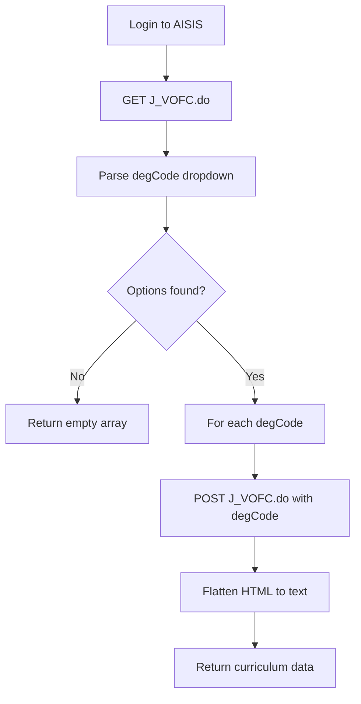

# Curriculum Scraping - Technical Details

## Current Status: EXPERIMENTAL SUPPORT VIA J_VOFC.do

The AISIS curriculum scraper now has **experimental support** using the `J_VOFC.do` endpoint discovered through HAR file analysis.

## Background

### Previous Limitation (J_VOPC.do)
The original implementation attempted to scrape official curriculum data using:
```
POST /j_aisis/J_VOPC.do
```

However, this endpoint **does not exist** in AISIS and returns **HTTP 404**.

### New Discovery (J_VOFC.do)
Through analysis of HAR file captures (`official curriculums.har`), a working curriculum endpoint was discovered:

```
Endpoint: https://aisis.ateneo.edu/j_aisis/J_VOFC.do
Method: GET (for form) / POST (for curriculum data)
Parameter: degCode (curriculum version identifier)
```

**How it works:**
1. GET `J_VOFC.do` returns a form with `<select name="degCode">` dropdown
2. Each option value represents a curriculum version (e.g., `BS CS_2024_1`)
3. POST `J_VOFC.do` with `degCode=<value>` returns curriculum HTML for that version

## Implementation Details

### Workflow



### Methods Implemented

#### 1. `getDegreePrograms()`
- **Purpose**: Retrieve all available curriculum versions
- **Process**:
  1. GET request to `J_VOFC.do`
  2. Parse `<select name="degCode">` element
  3. Extract all `<option>` values and labels
- **Returns**: Array of `{ degCode, label }` objects
- **Example**:
  ```javascript
  [
    { degCode: 'AB AM_2018_1', label: 'AB Applied Mathematics (2018-1)' },
    { degCode: 'BS CS_2024_1', label: 'BS Computer Science (2024-1)' },
    ...
  ]
  ```

#### 2. `scrapeCurriculum()`
- **Purpose**: Orchestrate full curriculum scraping
- **Process**:
  1. Call `getDegreePrograms()` to get list
  2. Iterate through each `degCode`
  3. Call `_scrapeDegree()` for each
  4. Flatten HTML using `_flattenCurriculumHtmlToText()`
  5. Aggregate results
- **Returns**: Array of `{ degCode, label, raw_text }` objects

#### 3. `_scrapeDegree(degCode, retryCount)`
- **Purpose**: Fetch curriculum HTML for a specific version
- **Process**:
  1. Build form data with `degCode` parameter
  2. POST to `J_VOFC.do`
  3. Validate session (check for login failures)
  4. Return raw HTML
- **Error Handling**:
  - Retries on 5xx errors (up to MAX_RETRIES)
  - Throws on 4xx errors with clear message
  - Detects session expiry

#### 4. `_flattenCurriculumHtmlToText(html)`
- **Purpose**: Convert curriculum HTML to structured text
- **Process**:
  1. Extract page/program header
  2. Traverse table rows
  3. Identify headers (year/semester) via `td.text04` class
  4. Identify course rows via `td.text02` or `td[background*="spacer_lightgrey"]`
  5. Join cells with tabs, lines with newlines
- **Returns**: Multi-line text with headers and tab-separated course data

### HTML Structure

Typical curriculum page structure:
```html
<div class="pageHeader">BS Computer Science (2024-1)</div>
<table>
  <tr>
    <td class="text04">First Year</td>
  </tr>
  <tr>
    <td class="text04">First Semester - 21.0 Units</td>
  </tr>
  <tr>
    <td class="text02">MA 18a</td>
    <td class="text02">Analytic Geometry and Calculus I</td>
    <td class="text02">5.0</td>
  </tr>
  <tr background="images/spacer_lightgrey.jpg">
    <td class="text02">EN 11</td>
    <td class="text02">Communication in English I</td>
    <td class="text02">3.0</td>
  </tr>
  ...
</table>
```

### Data Output

**Example Output:**
```
BS Computer Science (2024-1)

First Year
First Semester - 21.0 Units
MA 18a	Analytic Geometry and Calculus I	5.0
EN 11	Communication in English I	3.0
FIL 11	Sining ng Pakikipagtalastasan sa Filipino	3.0
...
```

## Important Warnings

### ⚠️ EXPERIMENTAL FEATURE
This implementation is **experimental** and **UI-dependent**:

1. **Fragile**: If AISIS changes the HTML structure, the scraper will break
2. **Unofficial**: This endpoint was discovered through network analysis, not official documentation
3. **No Guarantees**: AISIS may modify or remove this endpoint at any time
4. **Best Effort**: Data accuracy depends on correct HTML parsing

### Recommended Precautions

1. **Monitor Failures**: Watch for sudden drops in successful scrapes
2. **Validate Data**: Spot-check curriculum data for correctness
3. **Backup Strategy**: Maintain alternative curriculum data sources
4. **Graceful Degradation**: Application should handle empty curriculum data

## Error Handling

The implementation handles errors gracefully:

| Scenario | Behavior |
|----------|----------|
| degCode dropdown not found | Logs warning, returns empty array |
| Single curriculum fails | Logs error, continues with others |
| All curricula fail | Returns empty array with summary |
| Session expires | Throws clear error |
| 5xx server errors | Retries with backoff |
| Network errors | Throws with context |

## Integration with Existing Systems

### Supabase Sync
- Data type: `'curriculum'`
- Uses existing `syncToSupabase()` with batching
- Requires `transformCurriculumData()` if structured data needed

### Google Sheets Sync
- Sheet name: `'Curriculum'`
- Uses existing `syncData()` method
- Tab created automatically if doesn't exist

### Data Format
Current implementation outputs `raw_text` field for external parsing:
```javascript
{
  degCode: 'BS CS_2024_1',
  label: 'BS Computer Science (2024-1)',
  raw_text: 'First Year\nFirst Semester...'
}
```

For structured data, additional parsing would be needed to extract:
- Year levels
- Semesters
- Course codes
- Course titles
- Units
- Categories

## Alternative Solutions (Still Valid)

While J_VOFC.do provides a working solution, these alternatives remain viable:

### 1. Scrape Public Curriculum Pages
Scrape from `ateneo.edu/college/academics/degrees-majors`

**Pros:** Publicly accessible, officially maintained, stable
**Cons:** Different format, may require PDF parsing, less frequently updated

### 2. Manual Curriculum JSON
Curate curriculum data from official sources

**Pros:** Complete control, high quality, version controlled
**Cons:** Manual maintenance, labor-intensive, update lag

### 3. Request AISIS API Access
Contact administrators for official API

**Pros:** Stable, supported, comprehensive
**Cons:** Requires approval, uncertain timeline

## Recommendations

### Immediate
✅ Use experimental J_VOFC.do scraper with caution
✅ Monitor for failures and data quality issues
✅ Document known limitations for users

### Short-term (1-3 months)
- Implement structured curriculum parser on top of raw_text
- Add data validation to detect scraping failures
- Create fallback to cached curriculum data
- Monitor J_VOFC.do stability

### Medium-term (3-6 months)
- Evaluate alternative solutions for production use
- Consider hybrid approach (J_VOFC.do + manual curation)
- Build curriculum change detection system

### Long-term (6+ months)
- Request official AISIS API access
- Migrate to stable data source when available
- Build comprehensive curriculum database with versioning

## Testing

### Manual Testing Steps

1. **Test degCode discovery:**
   ```bash
   node test-curriculum-endpoint.js
   ```
   Expected: List of degCode values from dropdown

2. **Test single curriculum:**
   Modify test to scrape one degCode
   Expected: Non-empty HTML with curriculum content

3. **Test full scraper:**
   ```bash
   npm run curriculum
   ```
   Expected: `data/curriculum.json` created with curriculum data

4. **Validate output:**
   Check that flattened text contains:
   - Year/semester headers
   - Course codes and titles
   - Unit values

### Automated Testing

Current test infrastructure is minimal. Recommended additions:
- Unit tests for `_flattenCurriculumHtmlToText()` with sample HTML
- Integration test for `getDegreePrograms()` (requires credentials)
- Regression test to detect HTML structure changes

## Migration Notes

### From Previous "Not Supported" Version

If migrating from the version that returned empty arrays:

**Before:**
```javascript
const curricula = await scraper.scrapeCurriculum();
// Always returned []
```

**After:**
```javascript
const curricula = await scraper.scrapeCurriculum();
// May return array with curriculum data OR empty array
// Check length before processing
if (curricula.length > 0) {
  // Process curriculum data
}
```

**Breaking Changes:** None - API signature unchanged

**New Behavior:**
- May return non-empty array with curriculum data
- Data structure: `{ degCode, label, raw_text }`
- Additional logging during scraping process

## Conclusion

The curriculum scraper has been upgraded from "not supported" to **experimental support via J_VOFC.do**. While this provides working curriculum data, users should:

1. ✅ Understand the experimental nature
2. ✅ Monitor for failures
3. ✅ Have backup data sources
4. ✅ Validate scraped data
5. ✅ Be prepared for AISIS UI changes

For production systems requiring high reliability, consider supplementing with manual curriculum curation or pursuing official API access.

---

**Last Updated:** 2025-11-22
**Status:** Experimental - J_VOFC.do endpoint discovered and implemented
**Reliability:** Medium - depends on AISIS UI stability
